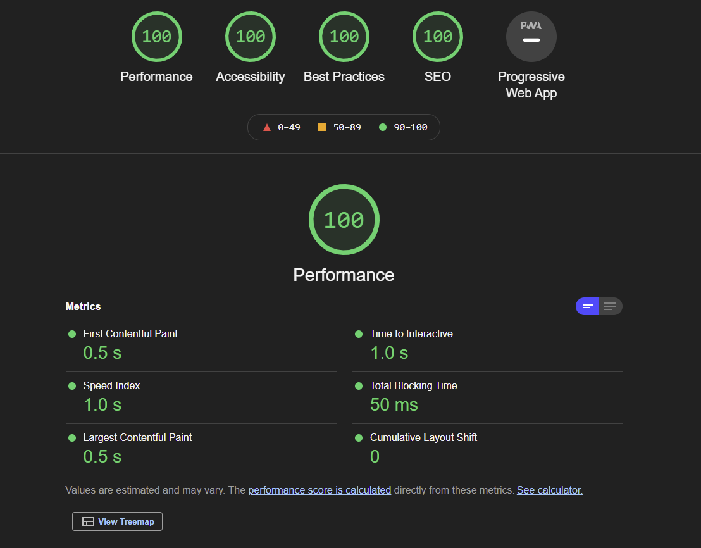
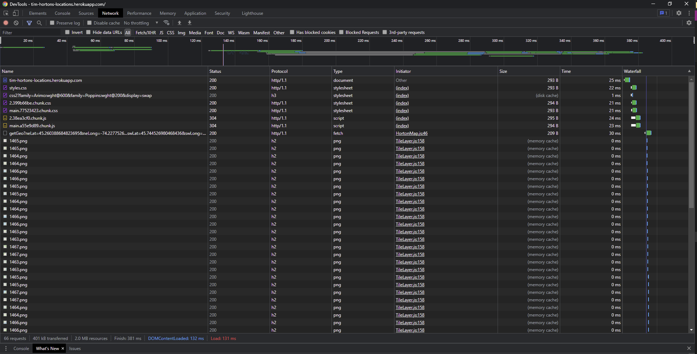
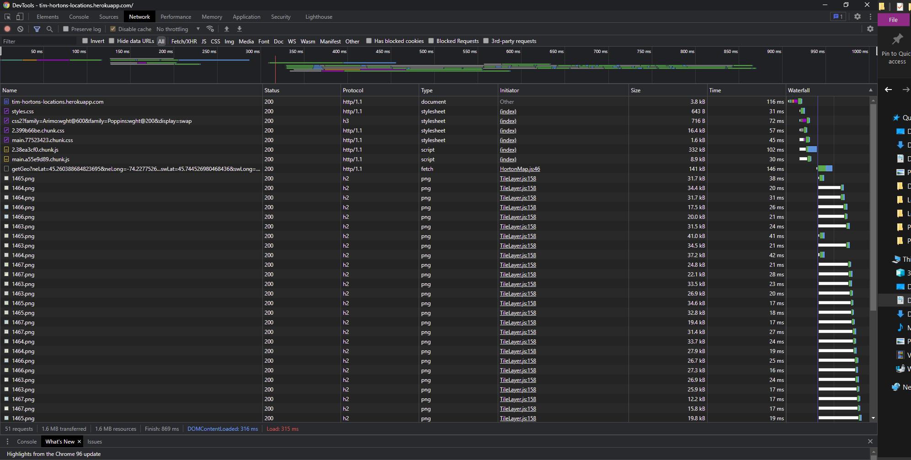

# 🍁 North American Tim Hortons Locations 🍁

Discover [Tim Hortons locations](http://tims-locations.herokuapp.com/) using React Leaflet!

## Summary of performance

At first, we ran lightouse locally and got a performance score of 30. Since we deployed, our results have been over 90. The highest score we got is 100 as seen below.

When cache is enabled, loading the page is faster.

On the other hand, without cache, it is slower.

